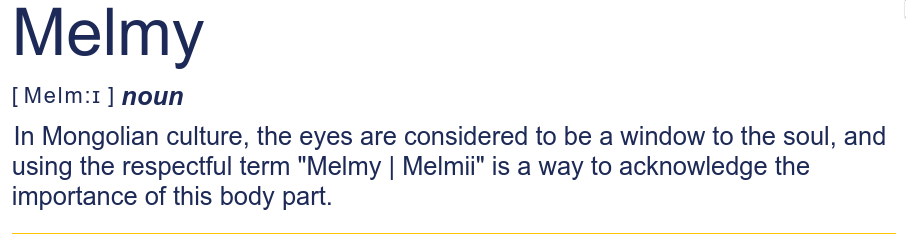

# Melmy

## About

Melmy is an application for image recognition and text-to-speech conversion, designed primarily for visually impaired individuals. With Melmy, users can take a picture of an object or text and the application will recognize the image and read out the contents for the user.

 ### Pronunciation: /ˈMelm:i/

 > This project is made for the Creation Competition at National University of Mongolia 2023
 > force redeployment